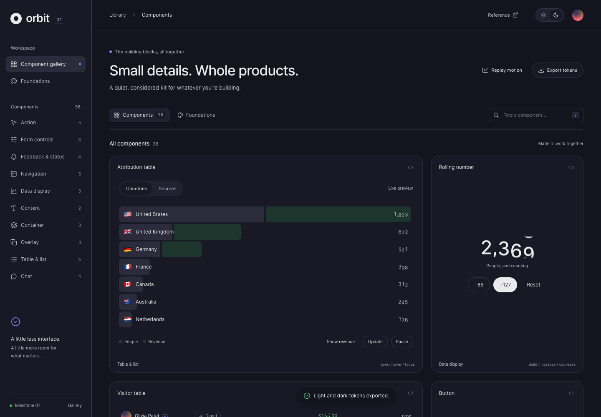

# Orbit UI

A working UI component gallery with 38 component families, light and dark themes, accessible controls, motion, rolling numbers, search, HTML inspection, and design-token export. Plain HTML, CSS, and JavaScript; no runtime dependencies or external API calls.

[Live demo](https://giovanitier.github.io/orbit/)



## Run locally

Install Node.js 22 or newer, then:

```sh
git clone https://github.com/giovanitier/orbit.git
cd orbit
npm ci
npm start
```

Open http://127.0.0.1:4318. No build is required for development. Alternatively, serve this folder with any static HTTP server.

## Test and build

```sh
npx playwright install chromium
npm test
npm run build
```

Tests start their own server and run five browser suites against the built site, covering the gallery, keyboard controls, themes, motion preferences, number transitions, files, and mobile layouts. Keep port 4318 free when testing. `dist/` contains the deployable site and local assets. GitHub Actions runs these checks and deploys successful main-branch builds to GitHub Pages.

## Project structure

- `index.html`, `app.js`, `styles.css`: gallery and component examples.
- `tokens.css`: theme and semantic design tokens.
- `motion.*`, `numbers.*`, `controls.*`: interaction primitives and styles.
- `assets/`: local fonts and third-party license notices.
- `checks/`: reproducible Playwright browser suites.
- `scripts/`: local server and static build.
- `starter.js`: supplemental starter-pattern source; currently not loaded by the gallery.

## Scope and reuse

This is a browser-based component gallery. Demo actions use local state; they do not upload files, create backend records, or contact services. Theme preference persists in the browser. Copied HTML depends on the shared styles and, for interactive examples, gallery event handlers. Framework packages and backend integrations are not included.

## Bundled licenses

OpenRunde fonts use the SIL Open Font License (`assets/OFL.txt`); Lucide icon paths use the ISC license (`assets/lucide-LICENSE.txt`). Original implementation and milestone details are documented in [HISTORY.md](HISTORY.md).
