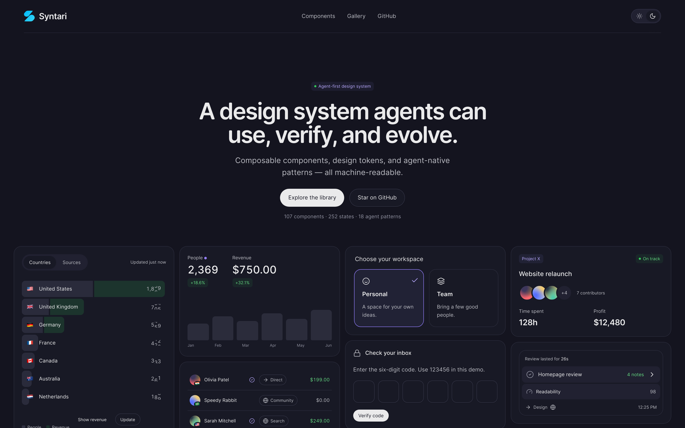

# Syntari

A design system that agents can understand, use, verify, and evolve.

Interactive components, design tokens, and agent-native patterns, with a machine-readable registry that agents can query, compose, validate, and safely evolve. Open source. Open code. **Use it to build your own agent-native interface library.**



## Documentation

Visit **[syntariui.github.io/syntari](https://syntariui.github.io/syntari/)** for the landing page, library, guides, and component documentation.

## Components

109 component families and 252 authored preview states and layouts, covering actions, form controls, navigation, data display, overlays, tables, chat, and agent interfaces.

- [Component gallery](https://syntariui.github.io/syntari/gallery.html) — live, interactive examples
- [Library](https://syntariui.github.io/syntari/library.html) — documentation and guides
- [Registry](https://syntariui.github.io/syntari/registry/index.json) — the machine-readable components, tokens, and schemas ([guide](./registry/README.md))

Every component page includes Preview / Usage / Code, its element contract, runtime API, and guidelines. All examples use the same editable HTML, CSS, and JavaScript runtime included in the source archive.

## Development

Use Node.js 22 or newer:

```sh
npm ci
npm run build
npm start
```

Open http://127.0.0.1:4318/ for the landing page, `/library.html` for the library, and `/gallery.html` for the gallery. Run `npm test` for the full browser and installer suite.

## Contributing

Please read the [contributing guide](./CONTRIBUTING.md).

## License

Licensed under the [MIT license](./LICENSE).
